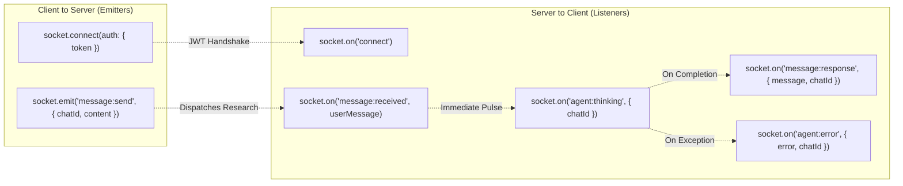
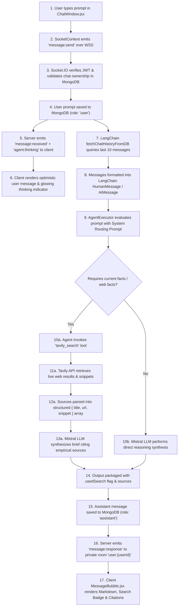
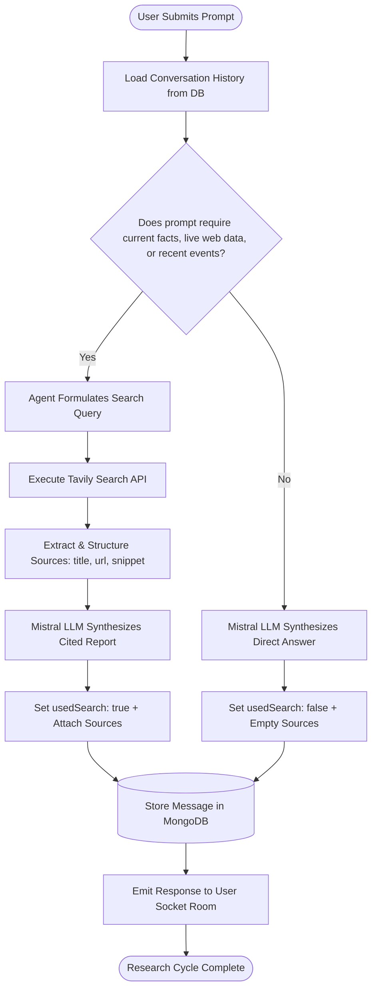
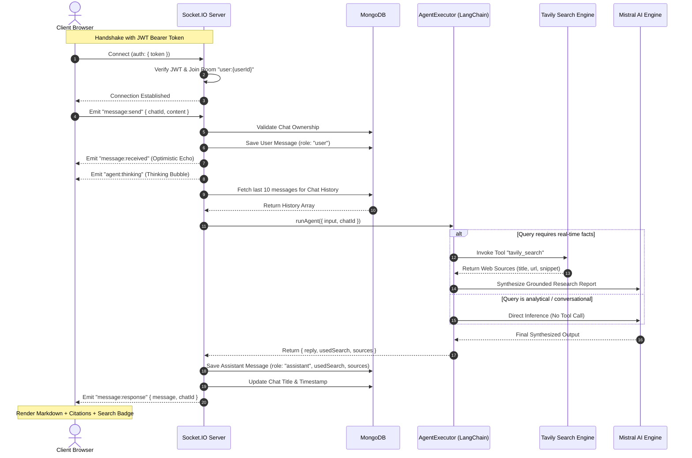
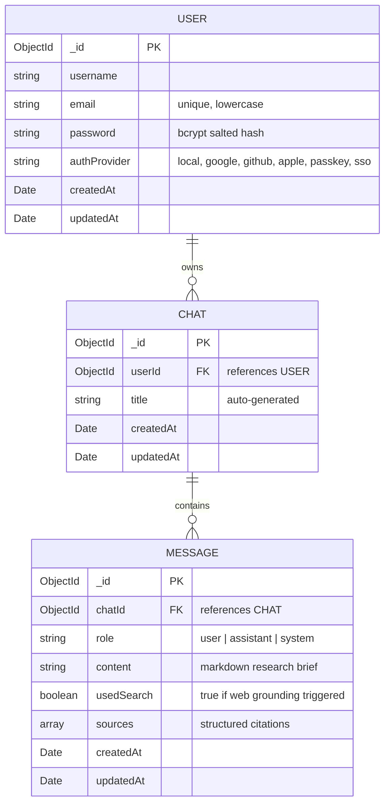
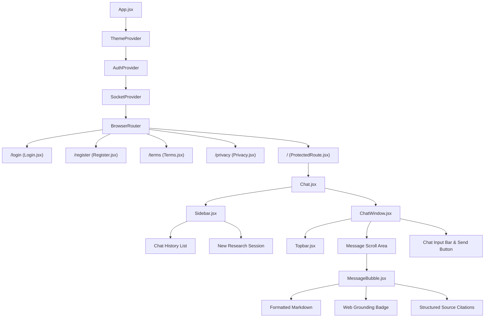

# Delvo Platform Architecture & System Maps

> **Autonomous AI Research Assistant with Real-Time Web Grounding & Live Streaming**

---

## Architecture Navigation & Map Index

- [1. System Topology & Network Map](#1-system-topology--network-map) — *Ports, hosts, protocols, and service connections*
- [2. Codebase Directory & File Map](#2-codebase-directory--file-map) — *Complete repository directory tree with file roles*
- [3. API, Route & Event Map](#3-api-route--event-map) — *Frontend routes, REST endpoints, and WebSocket channels*
- [4. Data Flow Journey Map](#4-data-flow-journey-map) — *Step-by-step lifecycle of an autonomous research query*
- [5. Autonomous Agent Decision Matrix](#5-autonomous-agent-decision-matrix) — *LangChain dynamic routing & web grounding heuristic*
- [6. Real-Time WebSocket & Agent Lifecycle](#6-real-time-websocket--agent-lifecycle) — *Bidirectional streaming sequence diagram*
- [7. Database Schema & Entity Relationship Map](#7-database-schema--entity-relationship-map) — *MongoDB collections and relational keys*
- [8. Frontend Component & Context Hierarchy](#8-frontend-component--context-hierarchy) — *React component tree and state providers*
- [9. Security, Authentication & Zero-Training Model](#9-security-authentication--zero-training-model) — *Zero-trust governance & privacy model*

---

## 1. System Topology & Network Map

The **System Topology Map** visualizes the physical, network, and service boundaries of the Delvo platform, including port bindings, communication protocols, and external APIs.

```mermaid
graph TB
    subgraph UserEnvironment["User Client Environment"]
        Browser["User Web Browser (Chrome / Safari / Edge / Firefox)"]
        LocalStorage[("Browser LocalStorage\n• JWT Token\n• Theme: dark/light")]
    end

    subgraph FrontendHost["Frontend Host (localhost:5173)"]
        ViteDev["Vite Dev / Static Server\nport: 5173 (TCP)"]
        ReactApp["React 18 Single Page App\n• React Router v6\n• Apple SF Pro Typography\n• Kinetic Smooth Scroll"]
    end

    subgraph BackendHost["Backend Application Host (localhost:5000)"]
        ExpressServer["Express.js Server\nport: 5000 (HTTP / TLS 1.3)"]
        SocketServer["Socket.IO WebSocket Server\npath: /socket.io (WSS)"]
        AuthMiddleware["JWT Authentication Guard\n• REST Bearer Auth\n• Socket.IO Handshake Auth"]
        AgentEngine["LangChain Agent Core\n• Multi-Turn Memory Loader\n• Tool Calling Controller"]
    end

    subgraph DatabaseHost["Database Tier (localhost:27017)"]
        MongoDB[("MongoDB Daemon\nmongodb://localhost:27017/delvo\n• Users Collection\n• Chats Collection\n• Messages Collection")]
    end

    subgraph ExternalCloud["External Cloud Intelligence APIs (HTTPS:443)"]
        MistralAPI["Mistral AI API\nhttps://api.mistral.ai/v1/chat/completions\nModel: codestral-latest / mistral-medium"]
        TavilyAPI["Tavily Search API\nhttps://api.tavily.com/search\nReal-Time Web Retrieval & Snippets"]
    end

    Browser -->|HTTP GET :5173| ViteDev
    ViteDev -->|Delivers HTML/JS/CSS| ReactApp
    ReactApp <-->|Read / Write Auth & Theme| LocalStorage

    ReactApp -->|REST API (JSON / Bearer Token)\nhttp://localhost:5000/api/*| ExpressServer
    ReactApp <-->|Bidirectional WebSockets\nws://localhost:5000/socket.io| SocketServer

    ExpressServer --> AuthMiddleware
    SocketServer --> AuthMiddleware
    AuthMiddleware -->|Mongoose ODM| MongoDB

    SocketServer -->|Dispatches Research Task| AgentEngine
    AgentEngine -->|Loads 10-turn Chat History| MongoDB
    AgentEngine -->|1. Reason & Route Prompt| MistralAPI
    AgentEngine -->|2. If web facts needed: Tool Call| TavilyAPI
    TavilyAPI -->|3. Return Title, URL, Snippet| AgentEngine
    AgentEngine -->|4. Synthesize Final Grounded Report| MistralAPI

    AgentEngine -->|5. Store User & Assistant Messages| MongoDB
    SocketServer -->|6. Stream Token-by-Token / Response| ReactApp
```

---

## 2. Codebase Directory & File Map

The **Codebase Map** details the physical location, responsibility, and dependencies of every module across the repository.

```
Delvo/
├── ARCHITECTURE.md                 # System architecture, topology, sequence & component maps
├── .gitignore                      # Git root exclusion rules
│
├── client/                         # FRONTEND APPLICATION (React 18 + Vite)
│   ├── index.html                  # HTML entry point, SEO tags, Apple viewport settings
│   ├── package.json                # Dependencies: react, react-router-dom, socket.io-client, lucide-react
│   ├── vite.config.js              # Vite bundler configuration & local dev proxy
│   └── src/
│       ├── main.jsx                # React root mount point (renders <App /> into #root)
│       ├── App.jsx                 # Route dispatcher & global Context Provider nesting
│       ├── index.css               # Apple-grade design system, tokens, typography & smooth scroll
│       ├── api/
│       │   └── client.js           # Fetch wrapper with JWT headers, error handling & base URL
│       ├── assets/                 # Icons, logos, and illustration media assets
│       ├── components/             # Reusable UI Components
│       │   ├── AuthBrandPanel.jsx  # Left branding showcase panel on Login/Register
│       │   ├── ChatWindow.jsx      # Message scroll area, chat input bar, and socket listeners
│       │   ├── DelvoLogo.jsx       # SVG wordmark and geometric triangle glyph
│       │   ├── MessageBubble.jsx   # Message renderer, markdown syntax, search pill & citations
│       │   ├── ProtectedRoute.jsx  # Route guard redirecting unauthenticated users to /login
│       │   ├── Sidebar.jsx         # Chat history drawer, session switcher & new chat action
│       │   └── ThemeToggle.jsx     # Smooth icon-based Dark Mode / Light Mode switcher
│       ├── context/                # Global React State Stores
│       │   ├── AuthContext.jsx     # User state, JWT store, login, register, social logins, logout
│       │   ├── SocketContext.jsx   # Active Socket.IO connection, room tracking & reconnect logic
│       │   ├── ThemeContext.jsx    # Dark/light theme persistence in localStorage & HTML attribute
│       │   ├── useAuth.js          # Custom consumer hook for AuthContext
│       │   └── useSocket.js        # Custom consumer hook for SocketContext
│       └── pages/                  # Top-Level Page Views
│           ├── Chat.jsx            # Main research app with sidebar, topbar & real-time chat
│           ├── Login.jsx           # Vercel-style multi-provider login (passkey, SSO, email)
│           ├── Register.jsx        # Multi-state signup flow with rotating customer proof ticker
│           ├── Terms.jsx           # Apple-grade Terms of Service with sticky TOC & progress bar
│           └── Privacy.jsx         # Apple-grade Privacy Policy with zero-training guarantee
│
└── server/                         # BACKEND APPLICATION (Node.js + Express + Socket.IO)
    ├── package.json                # Dependencies: express, socket.io, mongoose, langchain, @langchain/mistralai
    └── src/
        ├── index.js                # Server entry point, HTTP server, CORS, Socket.IO binding
        ├── config/
        │   └── db.js               # MongoDB connection setup with auto-reconnect & Mongoose options
        ├── middleware/
        │   └── auth.js             # Express middleware verifying JWT Bearer token on REST routes
        ├── models/                 # Mongoose Database Schemas
        │   ├── User.js             # User accounts, bcrypt password hashing, auth provider flags
        │   ├── Chat.js             # Research chat sessions, user ownership, auto-generated title
        │   └── Message.js          # Messages, roles, search flags, structured web citations array
        ├── routes/                 # REST API Controllers
        │   ├── auth.js             # /api/auth/register, /login, /me, /social-login
        │   └── chats.js            # /api/chats (GET list, POST new, GET single, DELETE, PATCH title)
        ├── socket/
        │   └── index.js            # Socket.IO JWT handshake auth, user rooms, message:send handler
        ├── agent/                  # Autonomous AI Engine
        │   ├── index.js            # LangChain AgentExecutor, tool calling, multi-turn DB history
        │   └── tavilyTool.js       # Tavily Search API wrapper with structured source metadata extraction
        └── tests/                  # Automated verification test suites
            ├── testAgent.js        # Direct test of Mistral + Tavily tool-calling agent
            ├── testAuthAndChatRoutes.js # Integration test of auth & chat REST APIs
            ├── testModels.js       # Unit tests for Mongoose models & validation
            └── testSocketAgent.js  # End-to-end WebSocket communication test
```

---

## 3. API, Route & Event Map

The **Interface Map** delineates every entrypoint, REST endpoint, and real-time WebSocket channel in Delvo.

### 3.1 Client Route Map (`React Router v6`)

| Route Path | Component | Access Level | Description |
| :--- | :--- | :--- | :--- |
| `/` | `Chat.jsx` | **Protected** (Auth Required) | Main autonomous AI research interface and chat history. |
| `/login` | `Login.jsx` | Public | Multi-provider authentication (Passkey, SSO, OAuth, Email). |
| `/register` | `Register.jsx` | Public | Multi-step signup flow with social buttons & enterprise ticker. |
| `/terms` | `Terms.jsx` | Public | Apple-grade Terms of Service with sticky TOC & reading bar. |
| `/privacy` | `Privacy.jsx` | Public | Apple-grade Privacy Policy with Zero-Training guarantees. |
| `*` | `Navigate to="/"` | Catch-all | Fallback redirect for undefined routes. |

### 3.2 Backend REST API Endpoint Map

| Method | Endpoint | Auth Required | Request Body | Response Payload |
| :--- | :--- | :---: | :--- | :--- |
| `GET` | `/api/health` | No | None | `{ status: "ok", timestamp }` |
| `POST` | `/api/auth/register` | No | `{ username, email, password }` | `{ user, token }` |
| `POST` | `/api/auth/login` | No | `{ email, password }` | `{ user, token }` |
| `POST` | `/api/auth/social-login`| No | `{ provider, email, username }` | `{ user, token }` |
| `GET` | `/api/auth/me` | **Yes** (Bearer) | None | `{ user }` |
| `GET` | `/api/chats` | **Yes** (Bearer) | None | `{ chats: [...] }` |
| `POST` | `/api/chats` | **Yes** (Bearer) | `{ title? }` | `{ chat: {...} }` |
| `GET` | `/api/chats/:id` | **Yes** (Bearer) | None | `{ chat, messages: [...] }` |
| `PATCH`| `/api/chats/:id` | **Yes** (Bearer) | `{ title }` | `{ chat: {...} }` |
| `DELETE`| `/api/chats/:id`| **Yes** (Bearer) | None | `{ message: "Chat deleted" }`|

### 3.3 WebSocket Real-Time Event Map (`Socket.IO`)



---

## 4. Data Flow Journey Map

This map traces the path of data from the moment a user types a research question to its display on screen:



---

## 5. Autonomous Agent Decision Matrix



---

## 6. Real-Time WebSocket & Agent Lifecycle



---

## 7. Database Schema & Entity Relationship Map



---

## 8. Frontend Component & Context Hierarchy



---

## 9. Security, Authentication & Zero-Training Model

Delvo incorporates enterprise-grade zero-trust principles across all layers:

### 1. Identity & Zero-Trust Authentication
- **Local Credentials**: Hashed with BCrypt ($\ge 10$ salt rounds). Plaintext passwords never touch logs or storage.
- **Hardware Passkeys (WebAuthn / FIDO2)**: Hardware-enclave cryptographic validation bound to user devices.
- **Enterprise SAML 2.0 Single Sign-On**: Federation with Okta, Azure AD, and Google Workspace.
- **OAuth 2.0 Providers**: Google, GitHub, Apple, OpenAI ChatGPT, GitLab, and Bitbucket.
- **Session Tokens**: Stateless JSON Web Tokens (JWT) signed with cryptographically secure secrets.

### 2. Zero Foundation Model Training Guarantee
- Delvo explicitly **never uses private research queries, uploaded documents, or chat history to train public foundation models**.
- All generative inference via Mistral AI is executed under enterprise zero-data-retention parameters.

### 3. Cryptography & Transport Security
- **In Transit**: Enforced TLS 1.3 encryption across all HTTPS endpoints and WSS socket streams.
- **At Rest**: AES-256 encrypted database volumes for MongoDB.
- **Isolation**: Multi-tenant logical isolation ensuring users only receive real-time events addressed to their private cryptographic room (`user:${userId}`).
